# Lab 1: Introduction to AWS and Infrastructure as Code

## 1. Overview and Objectives

This lab introduces you to fundamental AWS concepts and infrastructure-as-code practices. You will build a Virtual Private Cloud (VPC) with a public subnet, launch an EC2 instance, configure a web server inside the EC2, establish a VPC peering connection and monitor your infrastructure using CloudWatch. Finally, you'll recreate your infrastructure using Terraform to learn infrastructure-as-code principles.

**Team Structure:**
- Work in teams of 2
- You will need to find a partner team for Section 3.2 (VPC Peering)

**Learning Objectives:**
- Gain hands-on understanding of AWS
- Understand VPC networking fundamentals (subnets, internet gateways, route tables)
- Launch and configure EC2 instances
- Configure security groups for network access control
- Establish VPC peering connections between AWS accounts
- Monitor EC2 instances using CloudWatch
- Implement infrastructure-as-code using Terraform

## 2. Prerequisites

Before starting this lab, ensure you have the following installed and configured:

- **AWS Academy Learner Lab access**: Accept the invitation to AWS Academy and read `Academy Learner Lab Student Guide` (pages 3-7) and watch the video `Demo - How to Access Learner Lab`
- **WSL (Windows only)**: If you're on Windows, install Windows Subsystem for Linux (WSL) and use a Linux distribution (Ubuntu recommended)
- **Git**: Install Git and configure it with your name and email
- **GitHub Account**: Set up SSH authentication to be able to clone and push changes
- **Docker Desktop**: Install Docker Desktop for container support
- **Terraform**: Install Terraform (version 1.14 or later)
- **Visual Studio Code**: Install VS Code with recommended extensions:
  - Git Graph
  - Dev Containers
  - Python

## 3. Introduction

This lab is divided into two main parts:

**Part 1: Manual Configuration**: You will manually configure AWS resources through the AWS Console to understand the underlying concepts.

**Part 2: Infrastructure as Code**: You will recreate your infrastructure from the previous steps using Terraform.

The architecture diagram below shows the final network and instance layout used in this lab:

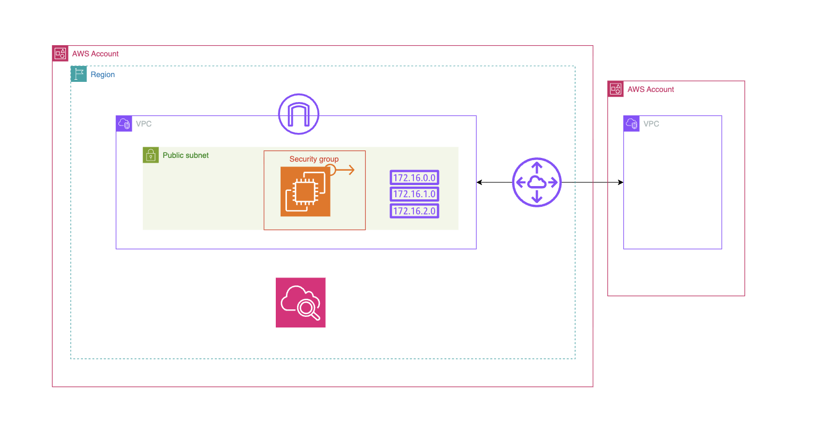

## 4. Accessing Your AWS Account

For this course, we use **AWS Academy Learner Lab** to provide access to real AWS accounts. These accounts have some limitations on available services and IAM roles to control costs, but include everything needed for this lab.

To access your AWS environment:

1. Go to **Modules** in your AWS Academy course and open **Launch AWS Academy Learner Lab**.
2. Click **Start Lab** to initialize your AWS session (the indicator will turn green when ready).
3. Click **AWS** to open the AWS Management Console in a new tab.

Make sure to keep an eye on remaining budget ($50), and avoid pressing the `Reset` button as you will lose all progress!

## Part 1: Manual Configuration

### 1. Configuring Your VPC

A Virtual Private Cloud (VPC) is your own isolated network within AWS. Think of it as your private data center in the cloud where you control the IP address ranges, subnets, and connectivity rules.

Now that we have access to our AWS account, we will create a VPC with a public subnet and internet gateway.

#### 1.1 - Go to the VPC service

Open the AWS Management Console and search for "VPC". Select the VPC service to start configuring your network resources.

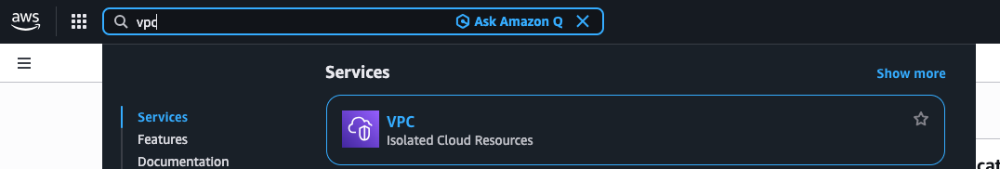

#### 1.2 - In the VPC service, go to your VPCs

From the VPC dashboard, click **VPCs** to view existing VPCs in the account and region.

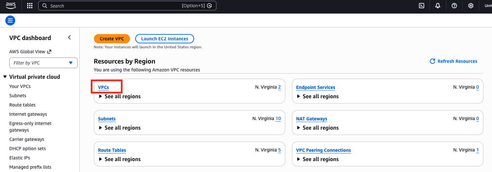

#### 1.3 - Click on Create VPC

Click the **Create VPC** button to begin the VPC creation wizard. The wizard guides you through naming the VPC, choosing an IPv4 CIDR block, and optionally creating subnets and gateways.

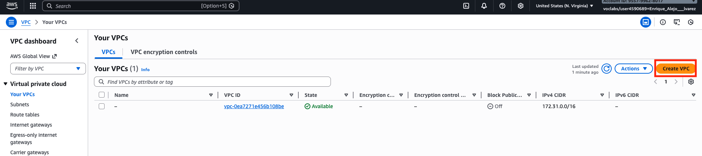

#### 1.4 - Create a VPC with the following settings

In the creation form, provide the basic settings for this lab. Typical values used in the lab are:

- **Name tag**: Choose a name appropriate for your team
- **IPv4 CIDR block**: Choose a /24 CIDR, and ensure this does not overlap with your partner's VPC!
- **IPv6 CIDR block**: None (IPv6 adoption is growing, but IPv4 is still the main system.)
- **Tenancy**: Default (only customers that have strict physical isolation requirements change this)
- **Number of AZs**: 1 (note that typically for high availability you would choose at least 2)
- **Number of Public Subnets**: 1 (will be used for an EC2 with public IPs)
- **Number of Private Subnets**: 0 (for this lab we won't be using them. However, for security reasons EC2s would typically go in private subnets.)
- **NAT GWs**: None (since the EC2 will have a public IP, there is no need for NAT)

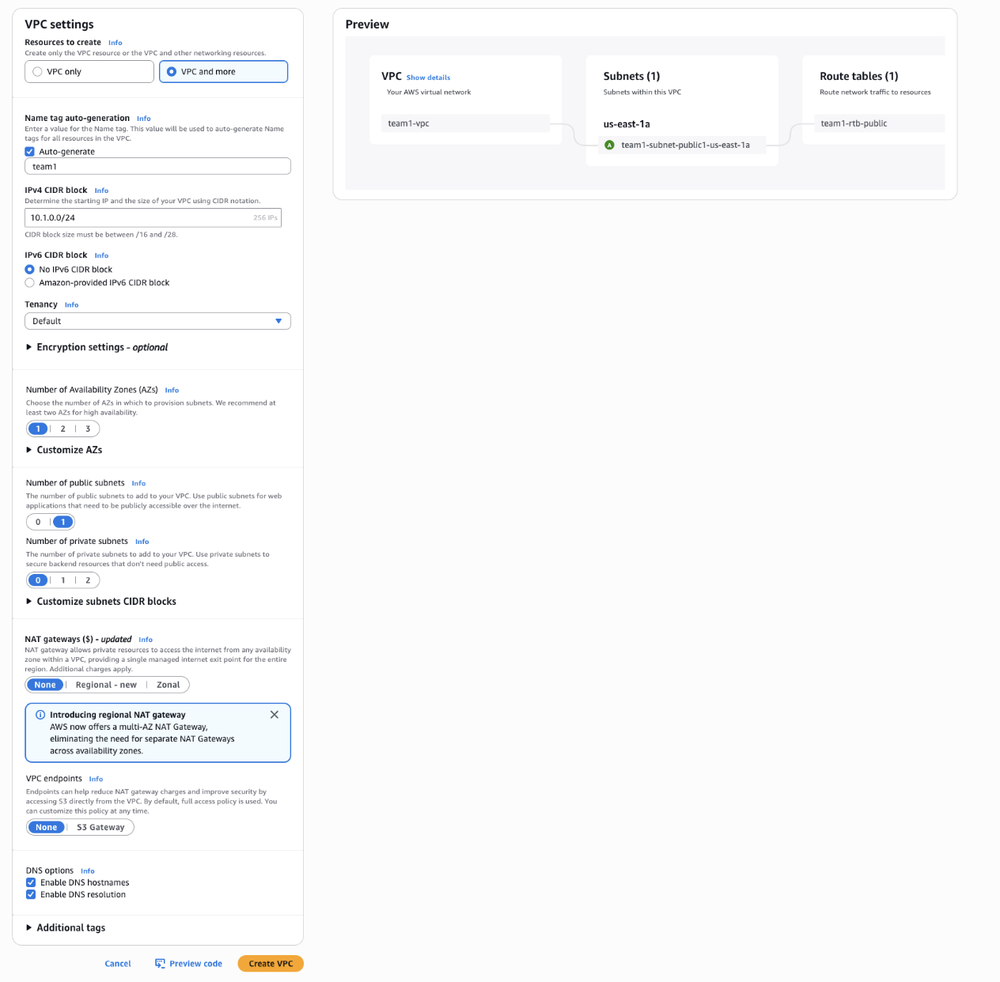

#### 1.5 - Verify resource creation

Confirm the VPC and its associated resources were created successfully. Inspect and document in your lab report the 4 resources this created.

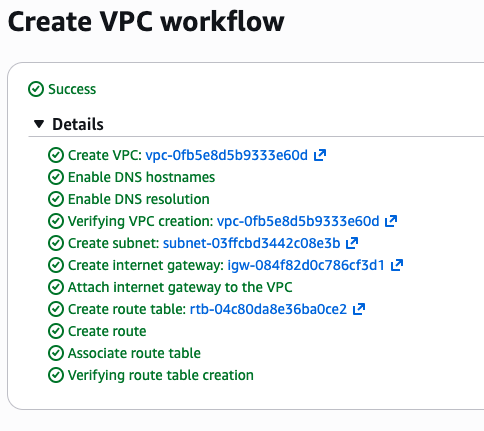

### 2. Launch Your EC2

EC2 (Elastic Compute Cloud) is AWS's virtual machine service. An EC2 instance is essentially a computer running in AWS's data center that you can configure and control remotely. In this section, you will launch an EC2 instance in your public subnet and configure a web server.

#### 2.1 - Go to instances in EC2 service

From the AWS console, go to the EC2 service and to the instances tab.

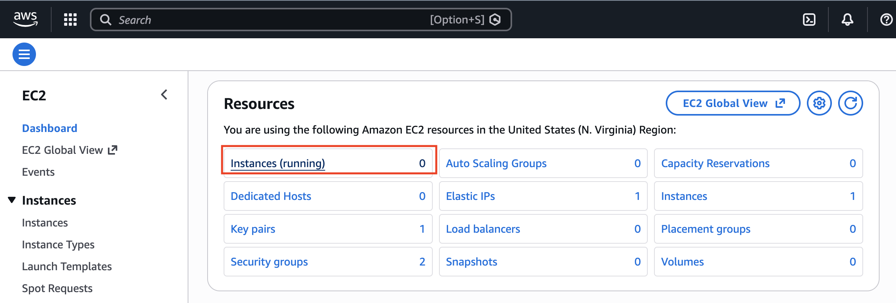

#### 2.2 - Click on Launch instances

From there, click the **Launch instances** button. This begins the instance creation wizard where you will select an Amazon Machine Image (AMI), configure the instance type, networking, storage, and other settings.

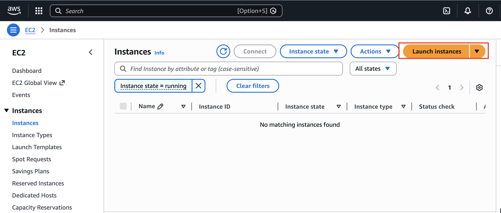

#### 2.3 - Configure the instance

We will use the following configuration for the instance:
1. **Name**: appropriate name for your team's VM
2. **AMI**: Amazon Linux 2023 kernel-6.1 AMI (the blueprint for creating the VM, contains info around preinstalled software, OS and other configurations)
3. **Instance Type**: t3.micro (defines the size of the VM in terms of CPUs, RAM and Network access)
4. **Key pair**: vockey (authorizes your lab's SSH key to connect to the EC2)

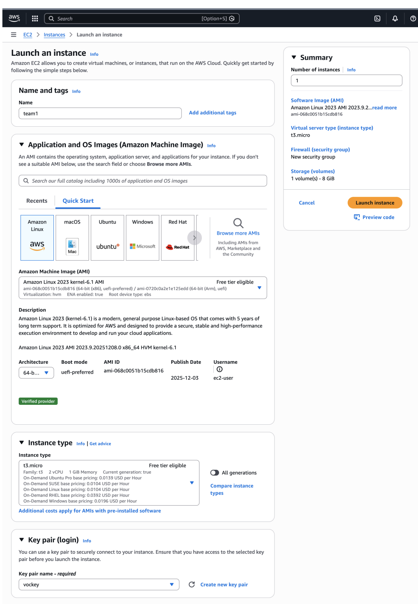

#### 2.4 - Configure networking settings

Select your VPC and public subnet created in Section 1. Enable **Auto-assign Public IP** so the instance receives a public IPv4 address for internet access.

A **security group** acts as a virtual firewall for your EC2 instance, controlling what traffic can reach it. By default, all inbound traffic is blocked and all outbound traffic is allowed. You must explicitly open the ports your application needs. Select create a new security group, and add inbound rules to allow HTTP (port 80) so browsers can reach your web server, and ICMP so you can ping the instance.

**Note**: Opening up HTTP traffic to all of the internet (0.0.0.0/0) is a huge security risk. We are only doing it in this lab for convencience.

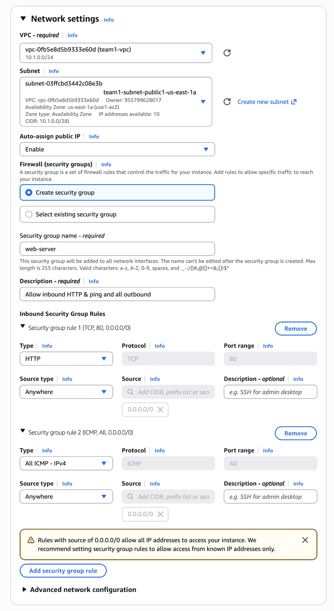

#### 2.5 - Configure storage and credentials

Configure the root volume size of your EC2 instance to have 20GiB of disk.
We will also add the LabInstanceProfile to the IAM instance profile setting. This authorizes the EC2 instance to use Sessions Manager so that we can connect to it. You can read about how Sessions Manager works compared to SSH [here](https://dev.to/afiqiqmal/aws-session-manager-vs-ssh-n3f).

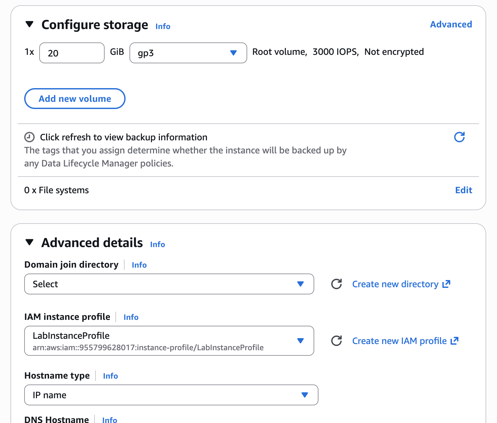

To receive metrics from our EC2 instance every minute instead of every 5 minutes, and thus get more granular monitoring, make sure to enable detailed monitoring as well.
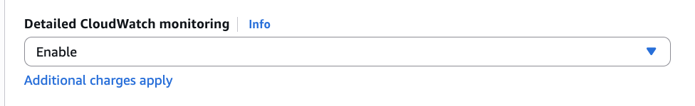

#### 2.6 - Launch the instance

Review the instance launch summary. Click **Launch Instance** to create and start the instance.

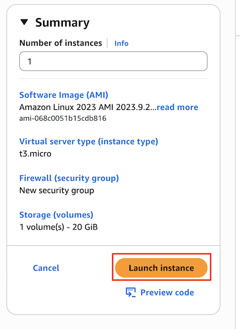

#### 2.7 - View instance details and click on Connect

Wait for the instance to enter "Running" state. Select the instance from the Instances list, then click the **Connect** button to open connection options for accessing the instance.

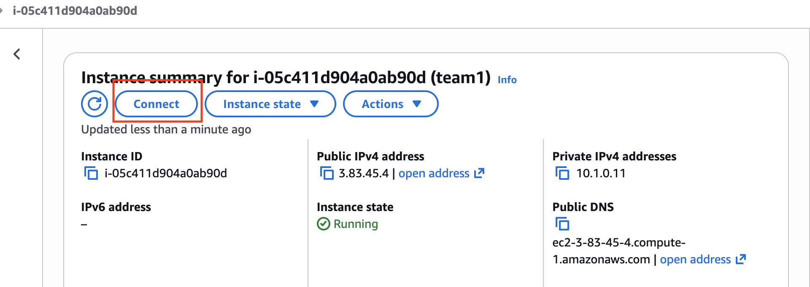

#### 2.8 - Connect using Session Manager

In the Connect dialog, select the **Session Manager** tab. Click **Connect** to open a browser-based terminal session with shell access to your instance. Session Manager requires no SSH keys and simplifies secure access.

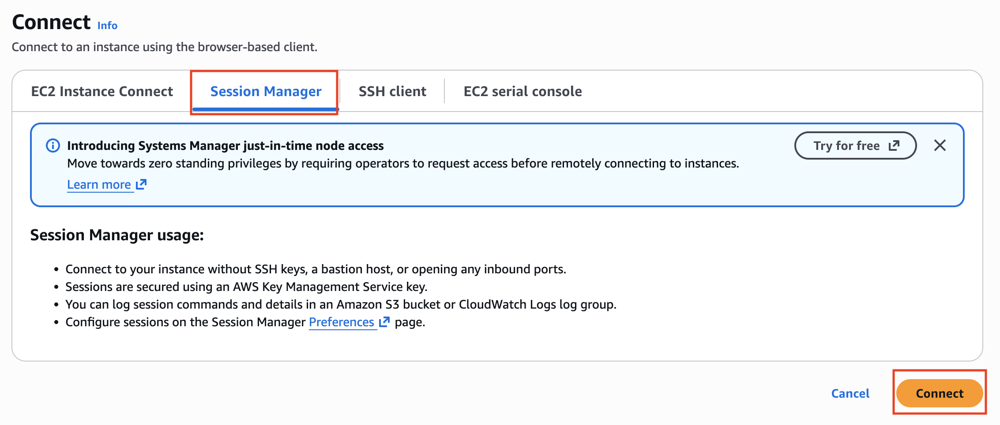

After clicking Connect, a new browser tab or window opens with a terminal interface. You now have command-line access to your EC2 instance and can run commands to configure the web server.

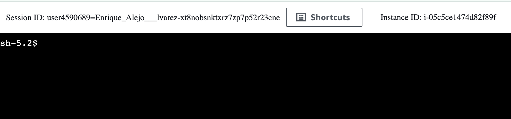

#### 2.9 - Run the commands from bootstrap-nginx.sh to configure your nginx web server on the EC2

Use the script found in `scripts/bootstrap-nginx.sh`. Copy and paste its contents in the Terminal. This will:
1. Updates all installed system packages to the latest available versions and applies security patches.
2. Installs the NGINX web server and any required dependencies from the system repositories.
3. Starts the NGINX service so it begins accepting HTTP requests immediately.
4. Configures NGINX to automatically start on every system boot.
5. Creates a basic HTML file that will be served as the default web page by the web server.
6. Places the HTML file in the standard NGINX document root so it is accessible via a browser.
7. Restarts the NGINX service to ensure the newly created web page is loaded and served.
8. Checks the current status of the NGINX service to confirm it is running successfully.

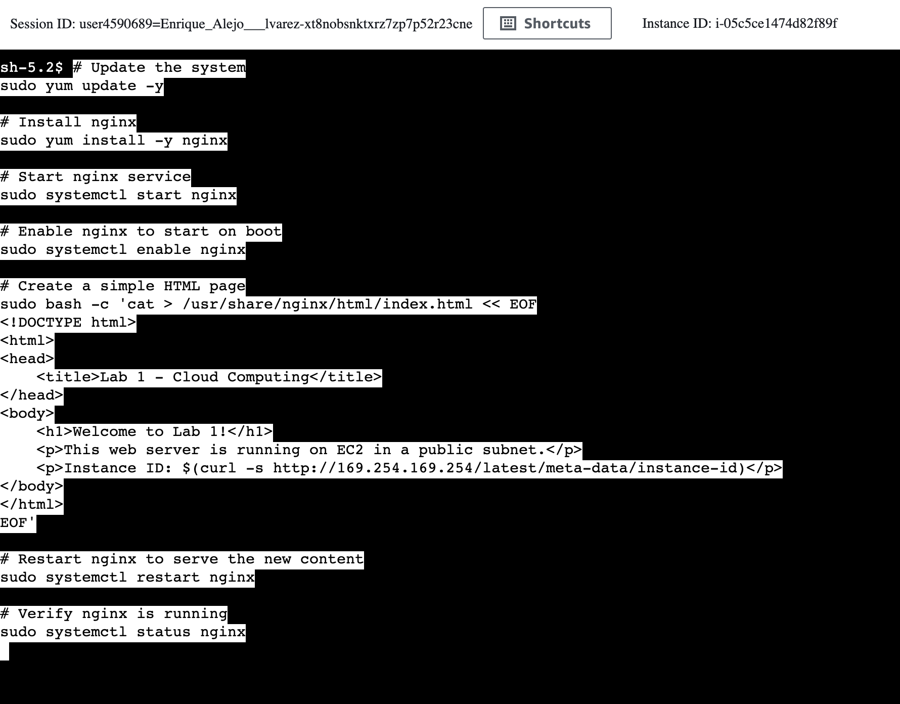

After running the bootstrap script, NGINX should be running and accessible. Check that you get a successful message like the one seen below.

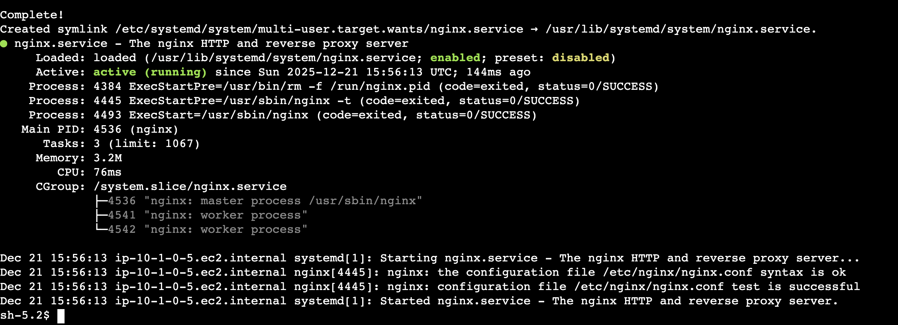

#### 2.10 - Query localhost to check that the web server is working

From the EC2 terminal, run `curl http://localhost` to verify that NGINX is serving content correctly. You should see the HTML welcome page returned, confirming the web server is operational and ready for public access.

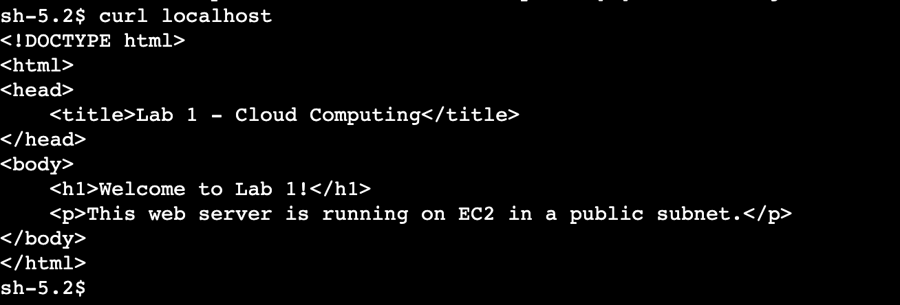


### 3. Reach Your Web Server

Now that your web server is running, you need to verify it's accessible. We'll test two access methods: via the public internet (using the public IP) and via private networking (using VPC peering). Understanding both is important because production systems often use private networking for internal communication while exposing only specific services publicly.

#### 3.1 - Access via Public IP

1. **Open the web server in a browser**
   - In a local browser, open `http://<your-public-ip>` (replace `<your-public-ip>` with the public IP of your EC2 instance).
   - This should show the simple NGINX welcome page created by the bootstrap script.

   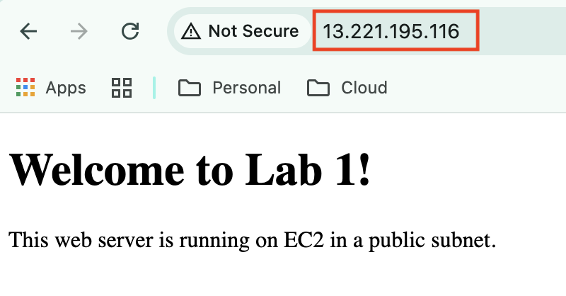

2. **Verify from your own terminal**
   - Run `curl http://<your-public-ip>` to ensure the public IP responds.

   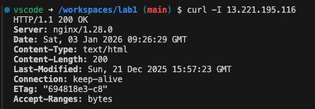

   - You can also `ping <your-public-ip>` to check basic network reachability.

   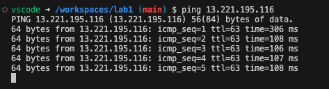

> **Note:** If you do not have a working Linux terminal configured (through Mac or WSL), use the terminal provided for you in the AWS Academy Portal.

#### 3.2 - Access via Private Network (VPC Peering)

If we use public IPs, our traffic is going through the public internet. This has a whole suite of problems:
- Since we are sending unencrypted traffic (HTTP communication), anyone can read it.
- Anyone can probe our web server and look for vulnerabilities.
- Attackers can overload our web server with distributed denial of service attacks (DDoS).

We can use VPC peering to create a private network connection that relies on the AWS networking backbone to communicate between EC2 instances. 

1. **Identify your VPC CIDR**
   - In the VPC Console, select `VPCs` and note your VPC's **IPv4 CIDR block** (you will need to share this with your partner).

   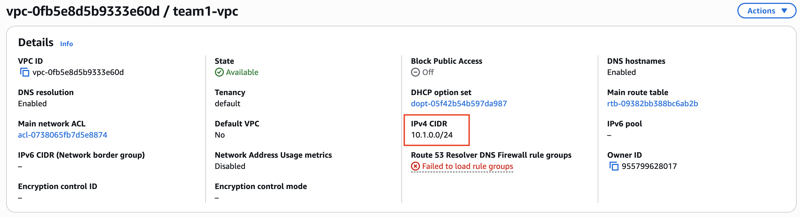

For the next steps, one team will be the requester team, and the other the accepter:

2. **Requester Team: Create the peering connection**
   - Navigate to `Peering Connections` → `Create peering connection`.
   - **VPC (Requester)**: Select your VPC.
   - **Account**: Choose `Another account` and enter your partner's AWS Account ID.
   - **VPC (Accepter)**: Enter your partner's VPC ID.
   - Click **Create peering connection** and copy the peering connection ID for your partner.

   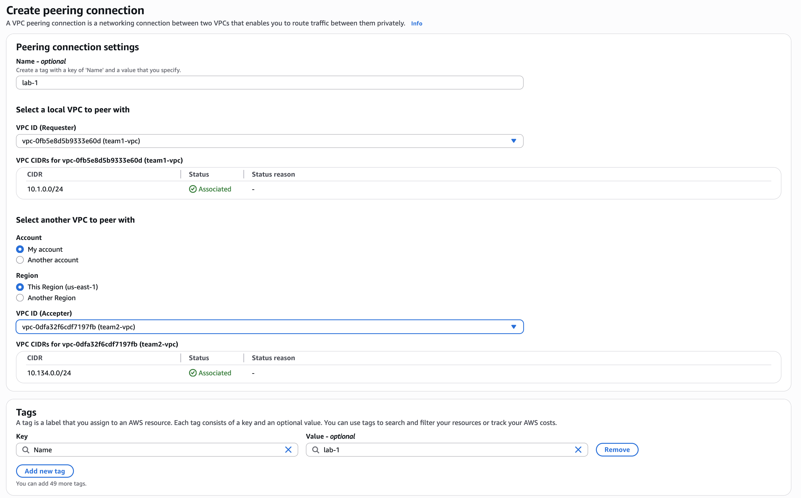

> **Note:** The image shows VPC Peering in the same account. In your case you will be peering to a different account.

3. **Accepter Team: Accept the pending peering connection**
   - Your partner will create the request; once they do, the accepter should go to `Peering Connections`, find the pending request, select it and choose **Actions → Accept request**.

   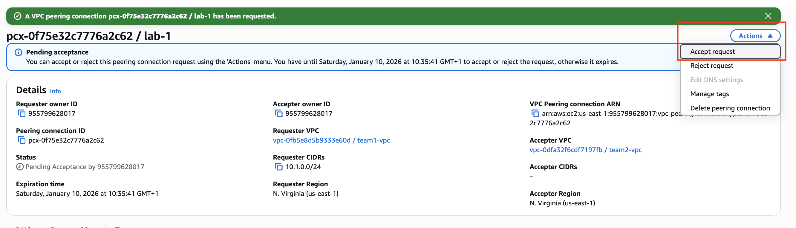

4. **Identify the route table used by your EC2 instance**
   - In the VPC Console go to `Route Tables` and find the route table associated with your public subnet.

   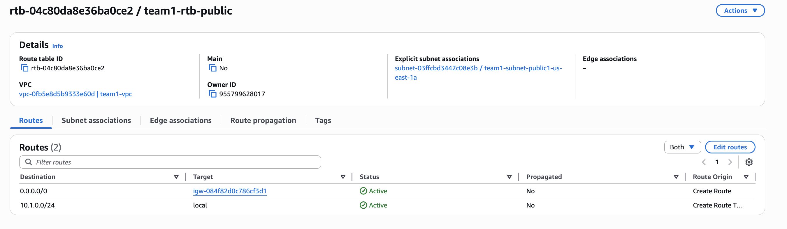

5. **Add a route to your partner's VPC** (both teams must do this)

   Creating a peering connection is not enough on its own. Your VPC needs to know *where* to send packets destined for your partner's IP range. Route tables tell AWS which path to use to reach a destination. Without this route, packets to your partner's CIDR would go nowhere.

   - In the identified route table, add a route with:
     - **Destination**: Partner's VPC CIDR.
     - **Target**: The VPC peering connection that you just created (pcx-...)
   - Save changes.
   - Repeat the same on your partner's route table pointing to your VPC CIDR.

   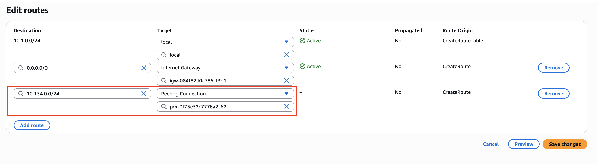

6. **Test connectivity across the peering connection**
   - From your EC2 instance (Session Manager shell), run:
     - `ping <partner-private-ip>` or `curl http://<partner-private-ip>` (use your partner's EC2 private IP)
   - You should see successful responses indicating that the private connectivity works as intended.

   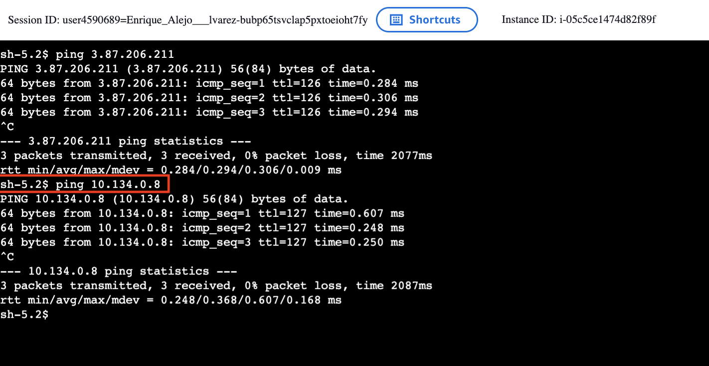

### 4. Monitor Your EC2

In production environments, you can't manually watch your servers 24/7. CloudWatch is AWS's monitoring service that collects metrics from your resources, lets you visualize them, and can trigger automated actions when thresholds are breached. In this section, you will monitor your EC2 instance using CloudWatch.

#### 4.1 - View CPU Utilization

A key metric to understanding the performance and utilization of our EC2 is observing CPU usage. This is typically shown as a percentage which shows how much of the processor's total capacity is actively busy executing tasks. In CloudWatch, under All Metrics, we can see that AWS populates some default metrics automatically for us, including EC2:

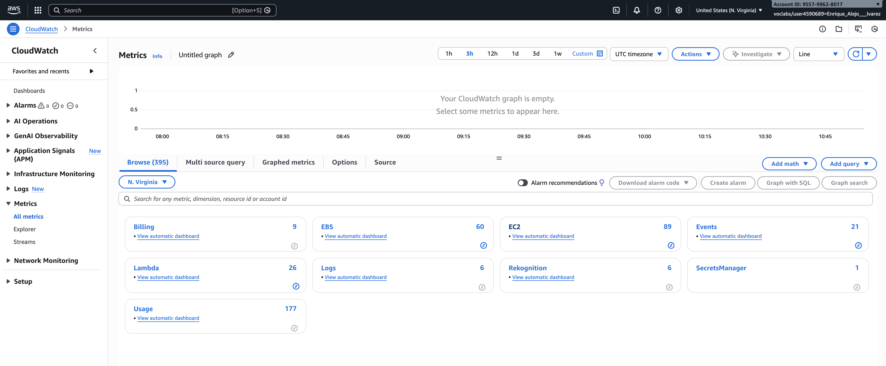

Use the metrics explorer UI to find the CPU utilization of the EC2 you launched:

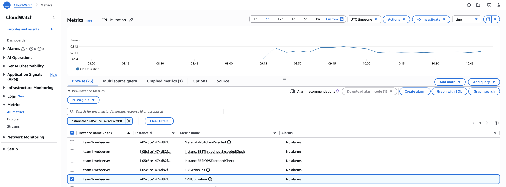

#### 4.2 - Create CloudWatch Alarm for High CPU Usage

It's good that we can see CPU utilization, but what if CPU starts to rise while we are sleeping and threatens the availability of our application? We want to create a notification system to either notify us, or run some automatic actions like autoscaling our application. In this section we will create an alarm that detects high CPU usage.

1. **Open CloudWatch Alarms and start the wizard**
   - In the AWS Console open **CloudWatch → Alarms** and click **Create alarm**.
   - Choose **Select metric** → **EC2** → **Per-Instance Metrics** and pick the `CPUUtilization` metric for your instance.

2. **Specify metric and threshold**
   - For **Threshold type** choose **Static**.
   - Set the condition **Whenever CPUUtilization is... Greater than** and enter the threshold value  of `70`.
   - Use a **Period** of `1 minute`.

   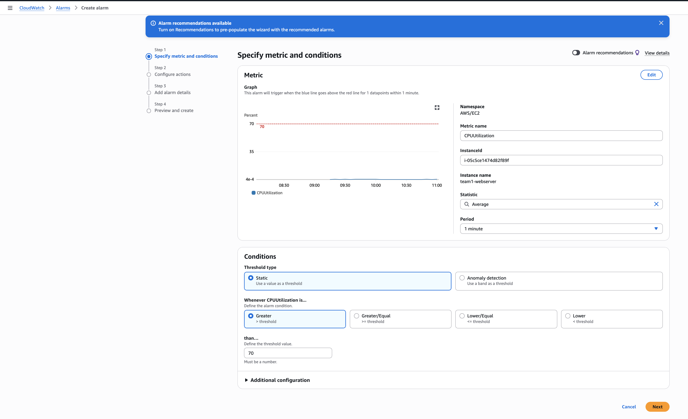

3. **Configure actions (notifications or automated responses)**
   - For this lab, we will only create the alarm and watch it go into alert state. We can click **Remove** to skip notification configuration for now.

   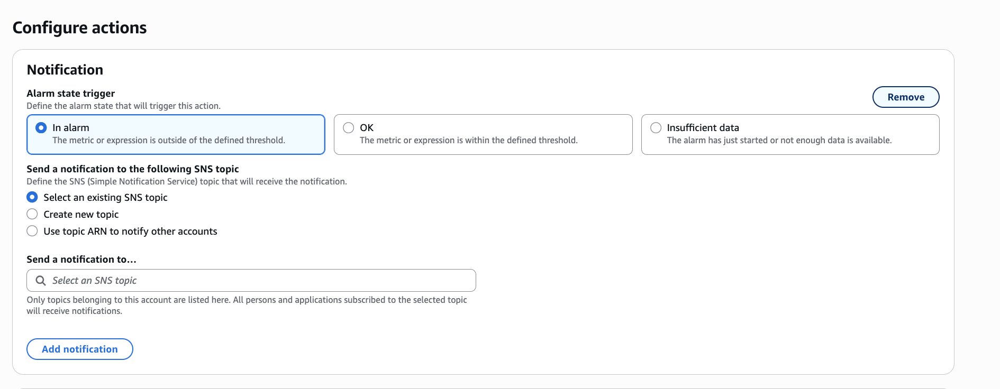

4. **Add alarm name and description**
   - Give the alarm a descriptive name such as `ec2-high-cpu` and add an optional description.
   - Click **Next** to proceed to the review step.

   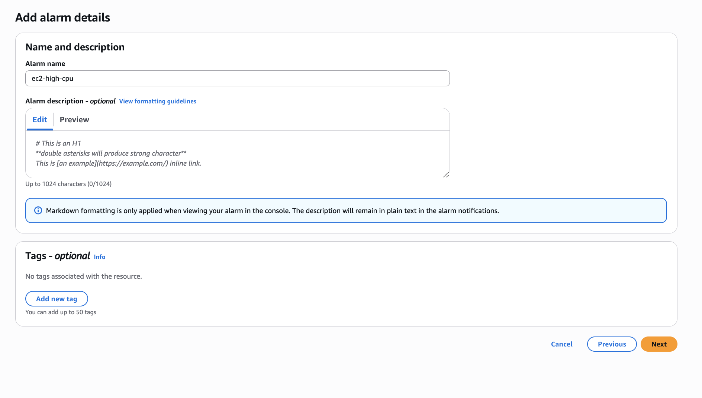

5. **Create the alarm**
   - Review settings and click **Create alarm**. The alarm will start evaluating the metric immediately.
   - Initially the alarm may show **Insufficient data** until enough datapoints are collected. Once metrics flow in, the alarm should show **OK** state since CPU is low.

   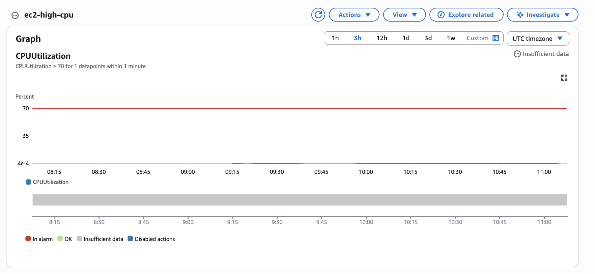

#### 4.3 - Test the Alarm by Generating CPU Load

Now that we have an alarm configured, let's test it by generating CPU load on the EC2 instance.

1. **Generate load on the EC2 to test the alarm**
   - Connect to your instance using Session Manager.
   - Install and run a CPU stress tool using the following commands:

   ```bash
   # Install stress-ng (example for Amazon Linux / Fedora families)
   sudo yum install -y stress-ng

   # Run stress to occupy all CPUs for 10 minutes
   stress-ng --cpu 0 --timeout 600s --metrics-brief --temp-path /tmp
   ```

   - The `--cpu 0` option uses all available CPUs. The tool will run for 10 minutes (600 seconds).

   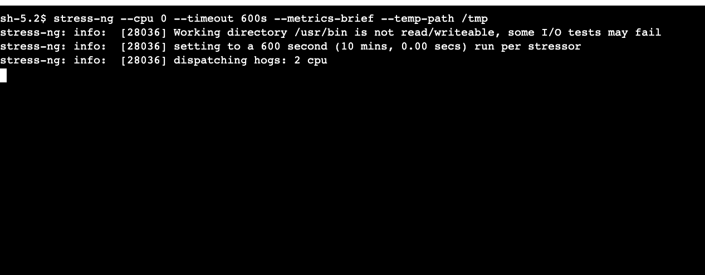

2. **Observe the alarm state and graph**
   - Leave the Sessions Manager tab open and the load generation script running
   - Go back to CloudWatch and open the alarm's detail page.
   - Observe the CPU utilization graph spike above the 70% threshold.
   - The alarm should transition from **OK** to **In alarm** state, indicating the threshold has been breached.

   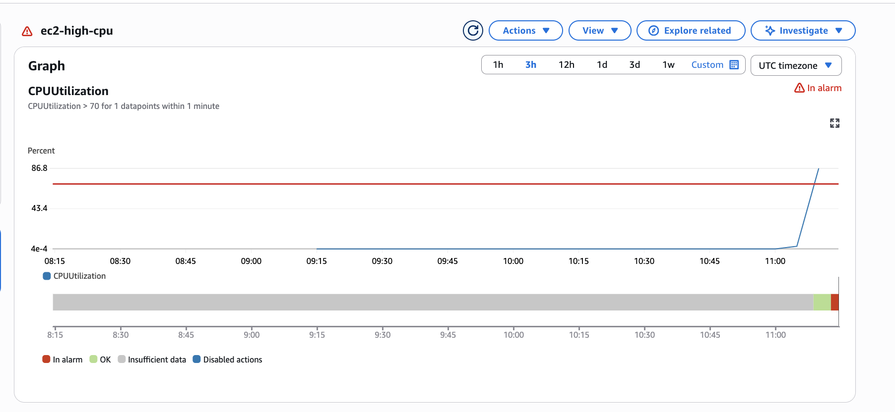


## Part 2: Infrastructure as Code

In this section, you will recreate your infrastructure using Terraform, learning infrastructure-as-code principles. Terraform allows you to define your infrastructure in code, making it reproducible, version-controlled, and easier to manage.

### 1. Bootstrap Your Git Repository

Clone this repository to your local machine. In the `/infra` folder you will find the starting point for deploying your solution in Terraform:

```
infra/
├── main.tf        # Main resource definitions (VPC already provided)
├── providers.tf   # Terraform and AWS provider configuration
├── variables.tf   # Input variable definitions
└── outputs.tf     # Output value definitions
```

The VPC resource is already defined in `main.tf` as a starting point. You will extend this to include the remaining resources.
You should be able to automatically configure the Web Server on start up using Terraform, as well as create the VPC Peering Connection.

### 2. Set Up State Bucket for Terraform

Terraform tracks all resources it creates in a **state file**. This file maps your configuration to real AWS resources, so Terraform knows what exists and what needs to change. By default, state is stored locally, but this breaks when multiple team members work on the same infrastructure—each person would have a different view of what exists. Storing state remotely in S3 ensures everyone shares the same source of truth.

We will use an S3 bucket created via CloudFormation, which is another IaC language.

1. **Go to CloudFormation in the AWS Console**
   - Search for "CloudFormation" and click **Create stack** → **With new resources (standard)**.

   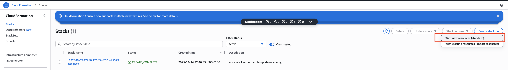

2. **Upload the template**
   - Select **Upload a template file** and upload the `scripts/tf-state.yaml` file from this repository.
   - This template creates an S3 bucket named `tf-state-<account-id>-<region>` to store your Terraform state.

   

3. **Create the stack**
   - Give the stack a name (e.g., `tf-state`).
   - Leave all other settings as default and click through to create the stack.
   - Wait for the stack status to show **CREATE_COMPLETE**.

   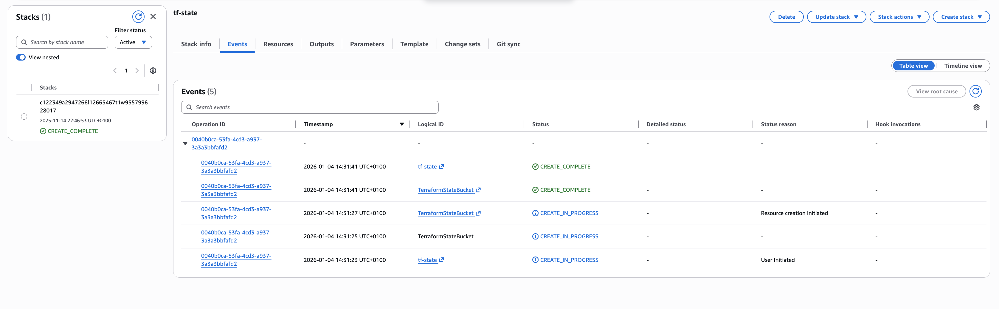

### 3. Configure Terraform Backend

Update the `infra/providers.tf` file to reference your state bucket. Replace the bucket name with your own (using your AWS account ID):

```hcl
terraform {
  backend "s3" {
    bucket       = "tf-state-<your-account-id>-us-east-1"
    key          = "lab1/terraform.tfstate"
    region       = "us-east-1"
    use_lockfile = true
  }
}
```

### 4. Develop Your Solution Using Terraform

Now you will replicate the infrastructure you created manually in Part 1 using Terraform.

1. **Configure AWS credentials**
   - In AWS Academy, click on **AWS Details** to open the credentials panel.
   - Click **Show** next to **AWS CLI** to reveal your temporary credentials.
   - Copy the credentials and paste them into your `~/.aws/credentials` file.

   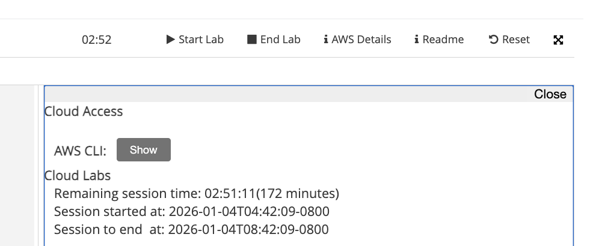

   > **Note:** These credentials are temporary and expire when your lab session ends. You will need to update them each time you start a new session.

2. **Initialize Terraform**

   The `init` command downloads the AWS provider plugin and configures the S3 backend. This must be run before any other Terraform commands and whenever you change the backend configuration.

   ```bash
   cd infra
   terraform init
   ```

   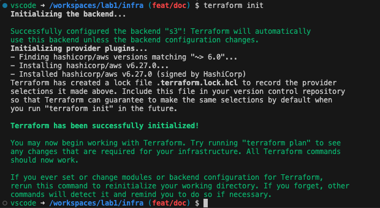

3. **Modify `terraform.tfvars` file** with your project-specific values. Remember that the CIDR range should not overlap with your partner team.

4. **Plan and apply your changes**

   The `plan` command shows what Terraform will do without making changes—always review this before applying. The `apply` command executes the plan and creates real resources in AWS.

   The bootstrap code contains an empty VPC that can be deployed by:
   ```bash
   terraform plan    # Review what will be created
   terraform apply   # Create the resources
   ```

   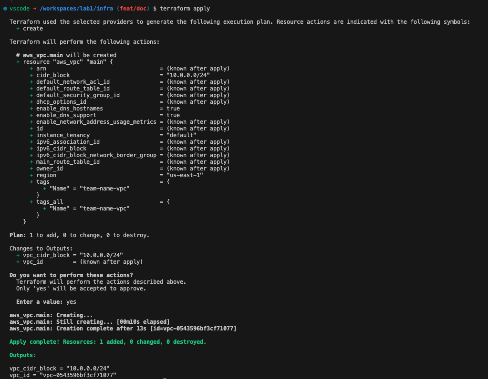

   It is now your turn to add all the infrastructure manually created in Part 1. You should rely on this documentation [Terraform AWS Provider Documentation](https://registry.terraform.io/providers/hashicorp/aws/latest/docs) to configure all the needed resources.

## Extra Credit

### 1. Connect to Your EC2 Instance Through SSH

We have connected to our EC2 instance using Session Manager. This is more secure, as we don't need to open ports to the internet, but it relies on AWS's proprietary technology. Another way to connect to our instance is through SSH. In Section 2.3 we added the vockey as a trusted key for our EC2 instance. We can download this key from AWS Academy and try to access our EC2 instance using SSH.

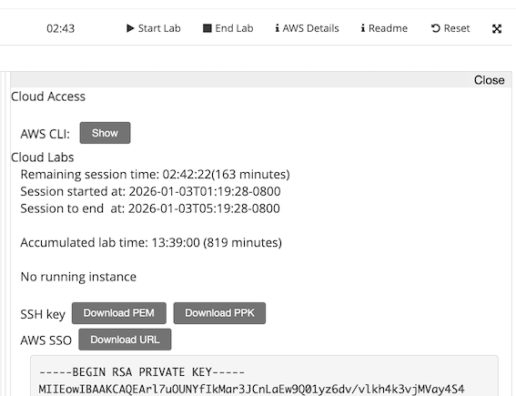

### 2. Build a Python Web App

Right now, NGINX is returning a static message when we access the web server. However, we can use a programming language like Python to return dynamic content. You can use NGINX, Uvicorn, and FastAPI to respond to HTTP requests with dynamic content generated by Python modules. You can start to learn about this configuration [here](https://fastapi.tiangolo.com/deployment/manually/#run-a-server-manually).

### 3. Configure Autoscaling and Load Balancing

The CloudWatch alarm we created only alerts us—it doesn't respond. In production, you'd use **Auto Scaling Groups** to automatically launch or terminate EC2 instances based on demand, and an **Application Load Balancer (ALB)** to distribute traffic across them.

Explore creating a Launch Template, Auto Scaling Group, and ALB to build a scalable, fault-tolerant web application. See the [EC2 Auto Scaling documentation](https://docs.aws.amazon.com/autoscaling/ec2/userguide/what-is-amazon-ec2-auto-scaling.html) and [ALB documentation](https://docs.aws.amazon.com/elasticloadbalancing/latest/application/introduction.html).

## Resources

- [AWS VPC Documentation](https://docs.aws.amazon.com/vpc/)
- [Terraform AWS Provider Documentation](https://registry.terraform.io/providers/hashicorp/aws/latest/docs)
- [CloudWatch Documentation](https://docs.aws.amazon.com/cloudwatch/)
- [EC2 User Guide](https://docs.aws.amazon.com/AWSEC2/latest/UserGuide/)

## Submission

You will need to create one lab report per team. At the bare minimum, it should include:
1. Names and student numbers of team members
2. Screenshots of your working web server (public IP access)
3. Screenshot of VPC peering connection status
4. Screenshot of connectivity with your partner team through private IP
5. Screenshot of CloudWatch alarm configuration
6. Link to your GitHub repository with Terraform code
7. Explain key concepts learned during the lab.
8. Explain problems you ran into and how you were able to solve them.
9. Answer to the following questions:
   - What is the purpose of an Internet Gateway in a VPC, and why is it required for your EC2 instance to be reachable from the internet?
   - Why did we need to add routes to the route tables after creating the VPC peering connection? What would happen if we skipped this step?
   - Explain the difference between a public and private subnet. Why might you place an EC2 instance in a private subnet in a production environment?
   - What are two advantages of using Infrastructure as Code (Terraform) instead of manually configuring resources through the AWS Console?
